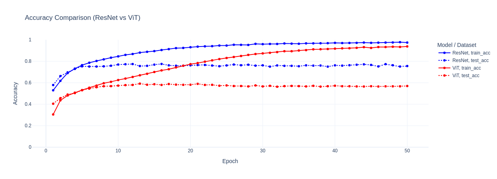
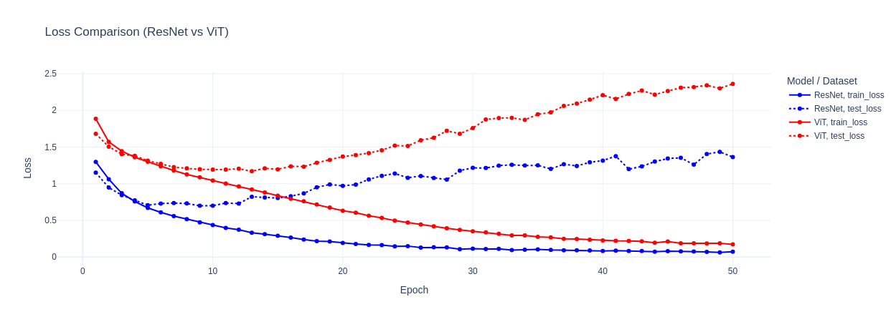

# Convolutional-Transformer
 implementing cnn's into the vision transformer arcitecure, instead of before the emebedding step, and comparing it with a purely convolution based resnet approch, a purely vision transformer approach

#### Dataset : [Cifar 10](https://huggingface.co/datasets/uoft-cs/cifar10)

### ResNet Config
    - Residual Blocks : 4
    - Conv Layers : 4*2 + 1
    - Max width : 64
    - Parameters : 230K
    - Avg Time per epoch : 22 sec 

### Vision Transformer Config
    - Self Attention Heads : 4
    - Transformer Blocks : 4
    - Embedding Dimension : 64
    - Parameters : 208K
    - Avg Time per epoch : 26 sec

#### WITH Convolution Enriched Encodings
    - Parameters : 245K
    - Avg Time per epoch : 27

